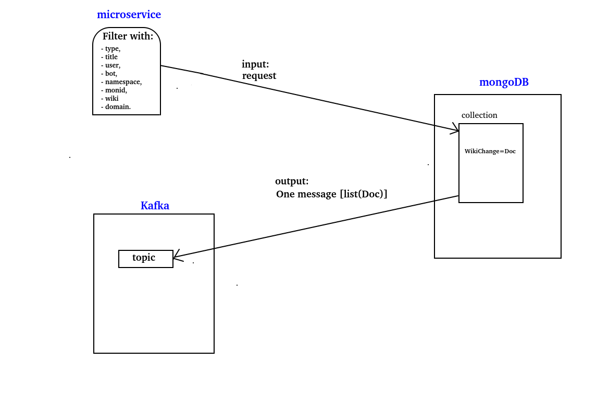
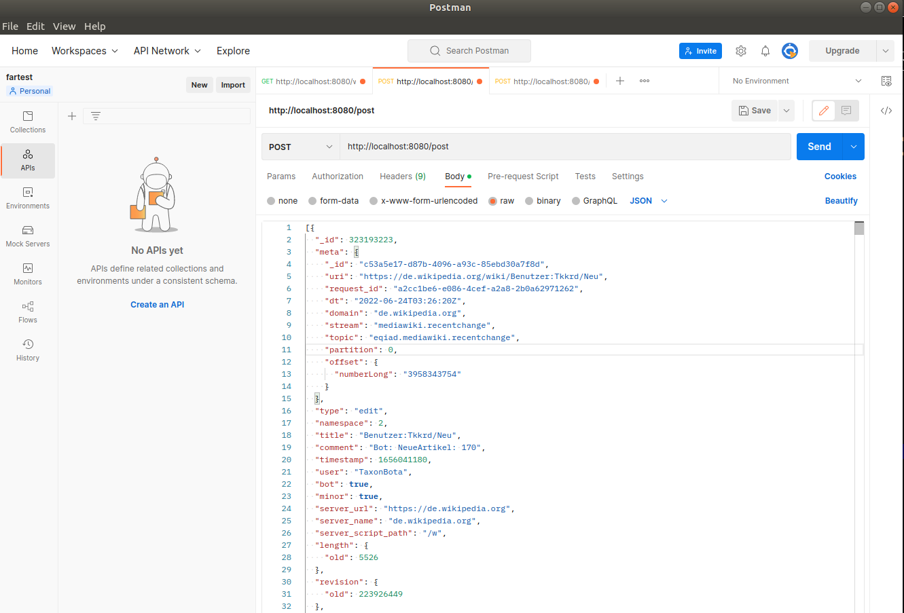
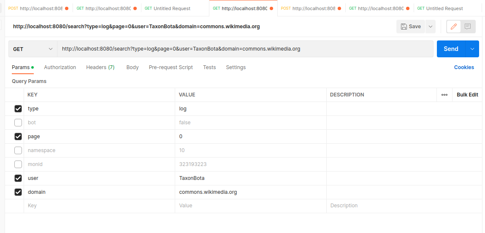

# Microservice, mongoDB filtering, kafka topic

## discription :
the project consists of doing the following tasks
1. enrichir une collection dans une base de données Mongodb conteneurisée avec des documents json (wikichange)
2. send an http request to filter with different criteria, then send the result obtained in a kafka topic in a single message.
 
 

## needed tools:
1. Docker (and docker-compose)
2. Java
3. Kafka
## how to use :
### 1. build services locally:
build services:zookeeper kafka brocker :
  _docker-compose up -d_
 
### 2. send data:
1. starts service(run main classes: _FilteringMongodbToKafkaApplication_)
2. send data given in _wikiChange.json_ file: 
   in postmen: copy past, post method, url: http://localhost:8080/post, send.
 
 

 
3. filter the data stored in the mongodb database (collection name: wikiChange) and send the result (one message per filter) to the kafka topic wikichangesresponses .
 
Filtering is possible on the following fields:

-  type, 
- title
- user, 
- bot,
- namespace,
- monid,
- domain.
### . Examples:
#### Example1:

-  serch all doccuments with:
   -  type="log"
   -  user="TaxonBota"
   -  domain="commons.wikimedia.org"
- need to launch: _curl --location --request GET 'http://localhost:8080/search?type=log&page=0&user=TaxonBota&domain=commons.wikimedia.org'_
#### Example2:
-  serch all doccuments withonly :
   type="log"

- need to launch: _curl --location --request GET 'http://localhost:8080/search?page=0&type=log'_

#### POSTMAN:

